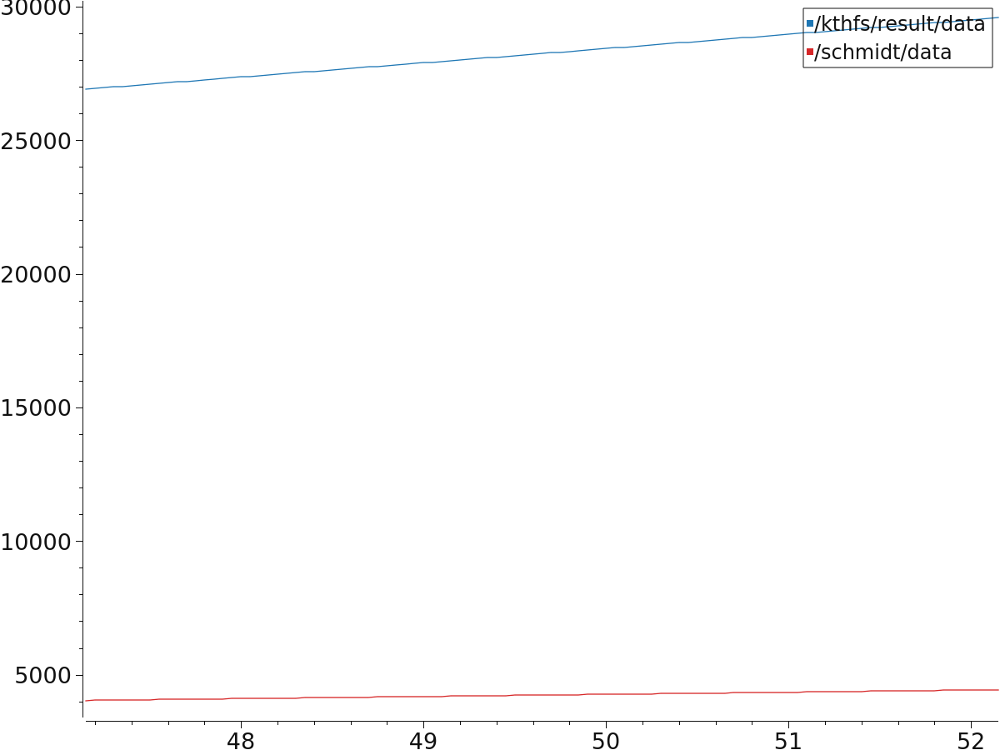
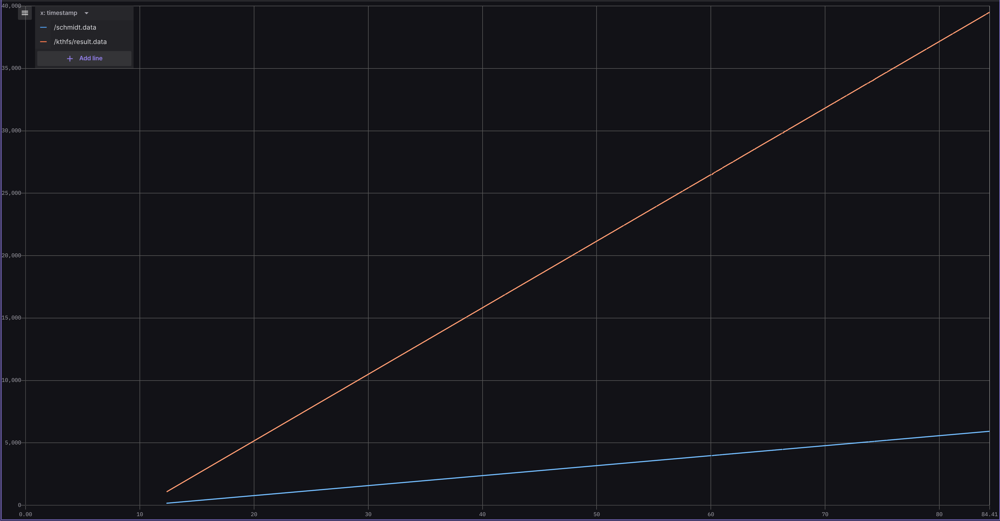

# KTHFS_exercise1
Publisher/Subscriber exercise for the application process at KTH Formula Student to show basic knowledge in ROS.

The repository includes two ROS packages that can be executed simultaniously by using the launch file in package1 after placing the packages in the `/src` directory of your workspace and building the workspace:

    $ source devel/setup.bash
    $ roslaunch package1 start.launch

## Message data plots
### Plot using plotjuggler

### Plot using Foxglove

